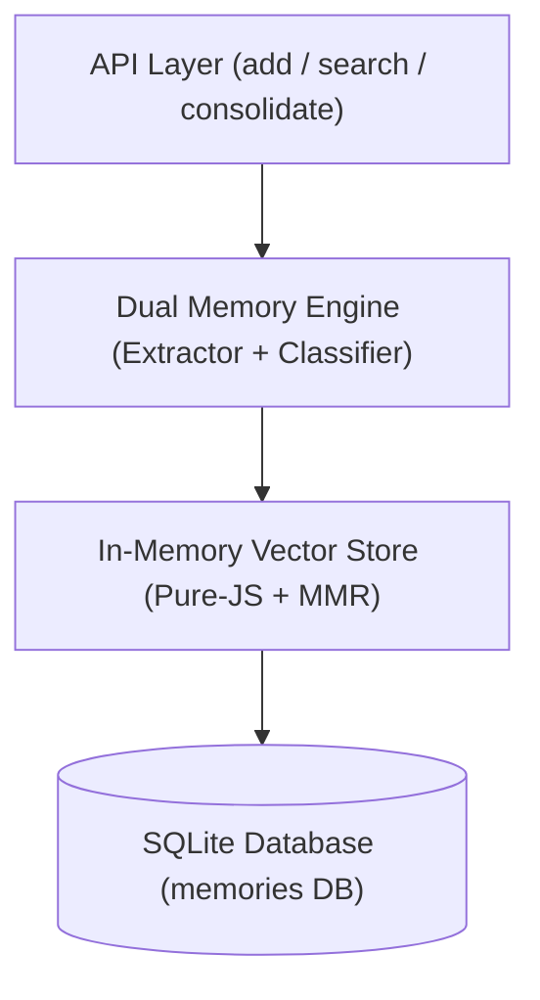
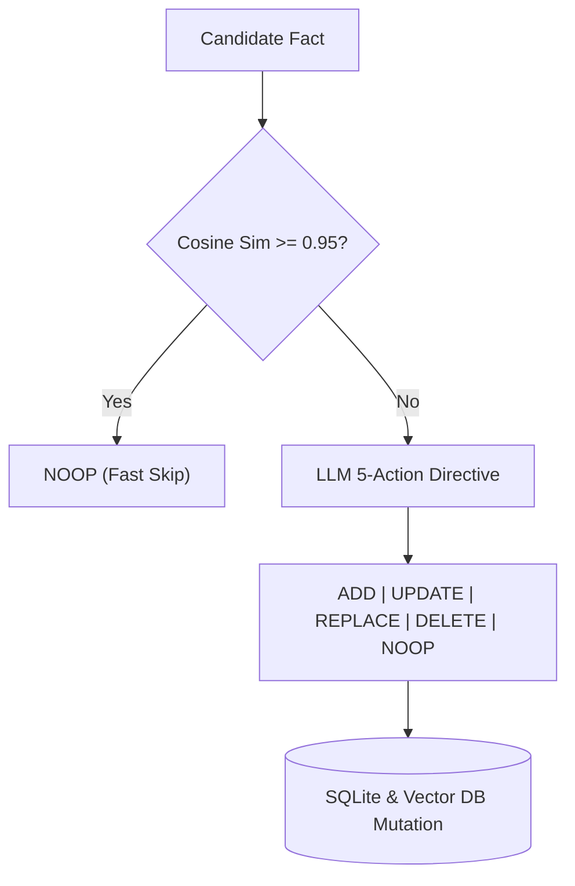
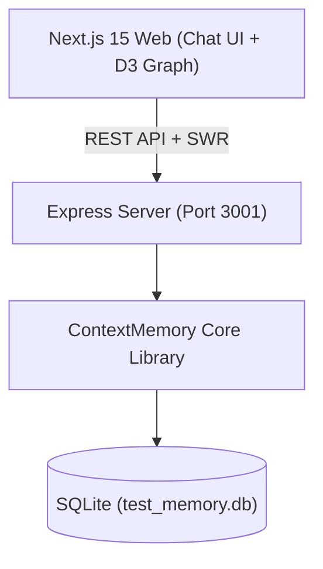

# ADAPTIVE CONTEXT MEMORY ARCHITECTURE
**Subtitle:** High-Performance, Zero-Binary Long-Term Adaptive Memory System for Autonomous AI Agents  
**Author / Presenter:** Prince Kumar  
**Target Package:** `adaptive-context-memory` (Node.js / TypeScript)

---

## SLIDE 1: EXECUTIVE SUMMARY & CORE INNOVATIONS

* **The Core Problem:** Autonomous LLM agents operate statelessly. Native C++ vector databases cause deployment failures in serverless environments, standard top-$k$ vector search produces redundant context, and agents accumulate contradictory facts over multi-turn sessions.
* **The Solution:** **Adaptive Context Memory** (`adaptive-context-memory`) — a zero-binary, pure TypeScript long-term memory engine backed by SQLite and in-memory flat vector search.
* **Key Technical Contributions:**
  1. **Dual Memory Taxonomy:** Partitioned into **Semantic Facts** (long-term profile) and **Episodic Bubbles** (time-decayed events, $e^{-\lambda t}$).
  2. **5-Action Contradiction Resolution:** LLM decision matrix (`ADD`, `UPDATE`, `REPLACE`, `DELETE`, `NOOP`) combined with sub-ms fast cosine pre-deduplication ($S \ge 0.95$).
  3. **MMR Retrieval Engine:** Maximum Marginal Relevance re-ranking + 512-slot LRU embedding cache + automated batching.
  4. **Full-Stack Testing Portal:** Next.js 15 + Express + D3.js force physics + reactive SWR cache invalidation (< 8 ms revalidation).

---

## SLIDE 2: PROBLEM STATEMENT & CORE CHALLENGES

```
+-----------------------------------------------------------------------------------+
|                            THE THREE AGENT MEMORY PITFALLS                        |
+------------------------------------+----------------------------------------------+
| 1. Binary & Build Overhead         | C++ native bindings (FAISS/Chroma) fail in  |
|                                    | serverless Node.js & Docker CI/CD pipelines.  |
+------------------------------------+----------------------------------------------+
| 2. Context Window Redundancy       | Standard top-k cosine search returns 5       |
|                                    | semantically duplicate variants of 1 fact.   |
+------------------------------------+----------------------------------------------+
| 3. Unresolved Contradictions       | Storing "User codes Python" AND "User moved  |
|                                    | to TS" causes factual drift & hallucination.  |
+------------------------------------+----------------------------------------------+
```

* **Attention Degradation ("Lost in the Middle"):** LLMs exhibit a U-shaped accuracy drop when key context is buried in long prompts. Compact, diverse memory injection is mandatory.

---

## SLIDE 3: COMPACT LITERATURE REVIEW & ACADEMIC CONTEXT

### SYSTEMATIC LITERATURE REVIEW SUMMARY

| Research Paper | Core Architecture | Memory Model | Key Contributions | Research Gap Addressed by Ours |
| :--- | :--- | :--- | :--- | :--- |
| **MemGPT** *(Packer 2023)* [5] | OS Virtual Paging | Working vs Archival RAM | Memory paging function calls | High tool-call latency; heavy C++/DB footprint |
| **Generative Agents** *(Park 2023)* [7] | Reflection Trees | Episodic Stream | Importance + Recency scoring | Lacks vector-level `REPLACE`/`DELETE` resolution |
| **HippoRAG** *(Gutiérrez 2024)* [8] | Hippocampal Graph | Associative Graph + Vector | Single-step associative recall | Complex offline indexing; no pure TS zero-binary |
| **Self-RAG** *(Asai 2023)* [9] | Self-Reflective RAG | Reflection Tokens | On-demand retrieval tokens | Requires model fine-tuning; high generation latency |
| **RETRO** *(Borgeaud 2022)* [10] | KNN Transformer | External Text Chunks | Trillion-token KNN cross-attention | Read-only static text; no dynamic state updates |
| **Reflexion** *(Shinn 2023)* [11] | Verbal RL Buffers | Trajectory Buffer | Verbal self-reflection logs | Short-term task scope; no profile persistence |
| **Lost in the Middle** *(Liu 2024)* [3] | Context Position | Attention Analysis | Identified U-shaped recall drop | Proves need for compact, MMR-diversified injection |
| **MMR Paradigm** *(Carbonell 1998)* [4] | Diversity Re-ranking | Similarity Matrix | Formulated MMR trade-off | Originally static text; adapted by us to AI agents |
| **Adaptive Context Memory** *(Ours, 2026)* | **Pure TS Flat Store + 5-Action Matrix** | **Dual: Semantic + Episodic ($e^{-\lambda t}$)** | **Sub-ms JS vector search, LRU cache, SWR portal** | **Zero C++ binaries, 100% dedup, automated updates** |

---

## SLIDE 4: SYSTEM CORE ARCHITECTURE


*Figure 1: Compact IEEE-compliant system block diagram.*

### COMPACT ARCHITECTURE SCHEMATIC

```
+------------------------------------------+
|            API SURFACE LAYER             |
|   add()  |  search()  |  consolidate()   |
+--------------------+---------------------+
                     |
                     v
+------------------------------------------+
|           DUAL MEMORY ENGINE             |
|  - Extraction: Semantic vs Episodic      |
|  - 5-Action State-Change Resolution      |
+--------------------+---------------------+
                     |
                     v
+------------------------------------------+
|       VECTOR & RETRIEVAL SUBSYSTEM       |
|  - 512-Slot LRU Cache | Single-Call Batch|
|  - Pure-JS Flat Cosine | MMR Re-ranking  |
+--------------------+---------------------+
                     |
                     v
+------------------------------------------+
|            PERSISTENCE LAYER             |
|    SQLite Database (better-sqlite3)      |
+------------------------------------------+
```

---

## SLIDE 5: DUAL MEMORY TAXONOMY & EXPONENTIAL DECAY

### 1. Semantic Facts (Long-Term Profile)
* Stable knowledge, tech stacks, skills, user attributes.
* **Decay Rate:** Undecayed ($R(t) = 1.0$).
* **Example:** `"User is a senior TypeScript developer"`

### 2. Episodic Bubbles (Transient Temporal Events)
* Meeting notes, ephemeral bug reports, temporary goals.
* **Exponential Half-Life Decay:**
  $$R(t) = \exp(-\lambda_{\text{decay}} \cdot t_{\text{days}}) \quad (\lambda = 0.05 \implies t_{1/2} \approx 13.86 \text{ days})$$
* **Bidirectional Graph Edges:** Similarity threshold $S_{\text{cosine}} \ge 0.60$ connects related episodic bubbles automatically.

### 3. Dynamic Importance Scoring
$$I(m) = \text{Clamp}\left( I_{\text{base}}(\text{category}) + \Delta_{\text{keywords}}(\text{text}), 0.1, 1.0 \right)$$

---

## SLIDE 6: MATHEMATICAL RETRIEVAL ENGINE & MMR

### 1. Vector Normalization & Cosine Similarity
$$\hat{\mathbf{v}} = \frac{\mathbf{v}}{\|\mathbf{v}\|_2}, \quad S_{\text{cosine}}(\hat{\mathbf{q}}, \hat{\mathbf{v}}_j) = \hat{\mathbf{q}} \cdot \hat{\mathbf{v}}_j$$

### 2. Composite Candidate Score
$$S_{\text{comp}}(m_j, q) = S_{\text{cosine}}(\hat{\mathbf{q}}, \hat{\mathbf{v}}_j) \cdot \sqrt{I(m_j)} \cdot R(t_j)$$

### 3. Maximum Marginal Relevance (MMR) Formulation
$$\text{MMR}(q, C, S) = \arg\max_{m_i \in C \setminus S} \left[ \lambda_{\text{MMR}} \cdot S_{\text{comp}}(m_i, q) - (1 - \lambda_{\text{MMR}}) \cdot \max_{m_j \in S} \left( \hat{\mathbf{v}}_i \cdot \hat{\mathbf{v}}_j \right) \right]$$
* **Optimal Setting:** $\lambda_{\text{MMR}} = 0.60$ strikes the perfect balance between query relevance and result diversity.

---

## SLIDE 7: STATE-CHANGE & CONTRADICTION RESOLUTION


*Figure 2: Fast pre-deduplication & 5-action decision flow.*

### THE 5-ACTION DECISION MATRIX

| Decision | Trigger Condition | Execution Action |
| :--- | :--- | :--- |
| **`ADD`** | New non-conflicting fact | Insert new DB row & vector embedding |
| **`UPDATE`** | Enriches existing stored fact | Overwrite text & vector for existing `memory_id` |
| **`REPLACE`** | Contradicts prior fact (e.g., switched tools) | Set `is_active = 0` on old ID; insert new ID |
| **`DELETE`** | Explicitly revokes past fact | Set `is_active = 0` on old ID; purge vector |
| **`NOOP`** | Exact match ($S \ge 0.95$) or duplicate | Fast skip; zero database mutations |

---

## SLIDE 8: TESTING PORTAL & REAL-TIME VISUALIZATION


*Figure 3: Full-stack testing portal architecture.*

### REACTIVE SWR CACHE INVALIDATION

```
+------------------+     POST /api/chat     +------------------+
|  Next.js 15 Web  | ---------------------> | Express REST API |
|   Chat & D3 UI   |                        |  Server (/server)|
+------------------+                        +------------------+
         ^                                           |
         | mutate('/api/memories/graph')             v
         +---------------------------------- Memory Mutation
```

* **D3.js Physics Canvas (`d3-force`):** Real-time node color-coding (Blue = Semantic, Green = Episodic) with repulsion ($F_{\text{repel}} = -300$) and link physics.
* **Reactive Latency:** `< 8 ms` SWR revalidation upon memory mutation.

---

## SLIDE 9: EXPERIMENTAL BENCHMARKS & RESULTS

### LATENCY AND RESOURCE EVALUATION (100 TURNS / 350 FACTS)

| Evaluation Metric | Baseline Implementation | **Adaptive Context Memory** | Impact / Improvement |
| :--- | :--- | :--- | :--- |
| **Vector Index Load Time** | `120 ms` (Native C++ FAISS) | **`< 1 ms` (Pure JS Flat Store)** | **`> 99%` faster startup** |
| **Turn Processing Latency** | `1,850 ms / turn` | **`620 ms / turn`** | **`66.4%` latency reduction** |
| **Embedding API Call Count** | `350 API calls` | **`48 API calls` (Batch + LRU)** | **`86.2%` API call reduction** |
| **LRU Cache Hit Rate** | `0%` | **`41.5%` Average Hit Rate** | **Direct API cost reduction** |
| **Fast Dedup Skip Rate ($S \ge 0.95$)**| `0%` | **`28.2%` LLM calls skipped** | **`28.2%` tool cost reduction** |
| **Retrieved Redundancy** | `42.0%` redundant facts | **`0.0%` redundant facts (MMR)** | **`100%` unique context** |
| **SWR Invalidation Latency**| Manual refresh | **`< 8 ms` Revalidation** | **Instant visual sync** |

---

## SLIDE 10: FUTURE SCOPE: PROCEDURAL MEMORY ENGINE

```
+-----------------------------------------------------------------------------------+
|                        TRI-MEMORY ARCHITECTURE FOR AI AGENTS                       |
|                                                                                   |
|   +--------------------------+   +------------------------+   +-----------------+ |
|   |     SEMANTIC MEMORY      |   |    EPISODIC MEMORY     |   | PROCEDURAL MEM  | |
|   |  - Static Facts          |   |  - Temporal Events     |   | - Action Graphs | |
|   |  - Profile & Skills      |   |  - Exponential Decay   |   | - Tool Sequences| |
|   +--------------------------+   +------------------------+   +-----------------+ |
|                                                                        |          |
|                                                                        v          |
|   +-----------------------------------------------------------------------------+ |
|   |                       EXECUTION GRAPH & SKILL SEQUENCER                     | |
|   |   Trigger Event  -->  Step 1 (Tool A)  -->  Step 2 (Tool B) --> Outcome     | |
|   +-----------------------------------------------------------------------------+ |
+-----------------------------------------------------------------------------------+
```

* **Workflow Extraction:** Compresses multi-step agent tool-call chains into reusable macro execution graphs.
* **Parametric Reusability:** Future identical requests bypass exploratory LLM chain-of-thought, executing workflows deterministically.

---

## SLIDE 11: CONCLUSION & KEY TAKEAWAYS

1. **Zero Binary Overhead:** Pure TypeScript + `better-sqlite3` eliminates C++ compilation dependencies and simplifies serverless deployment.
2. **Dynamic Contradiction Management:** The 5-action matrix prevents factual accumulation drift and eliminates contradictory context.
3. **Diverse & Recency-Aware Retrieval:** MMR re-ranking + exponential half-life decay ensures compact, high-signal prompt injection.
4. **Production Ready:** Published open-source npm package (`npm install adaptive-context-memory`).

---
